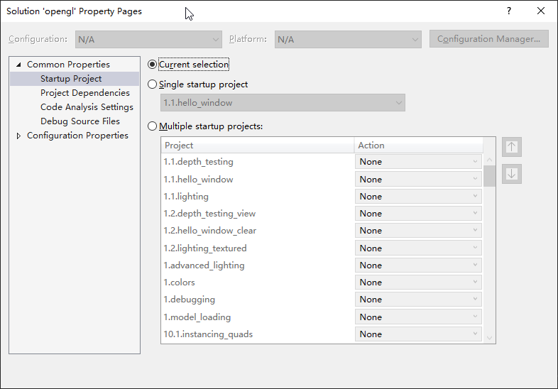
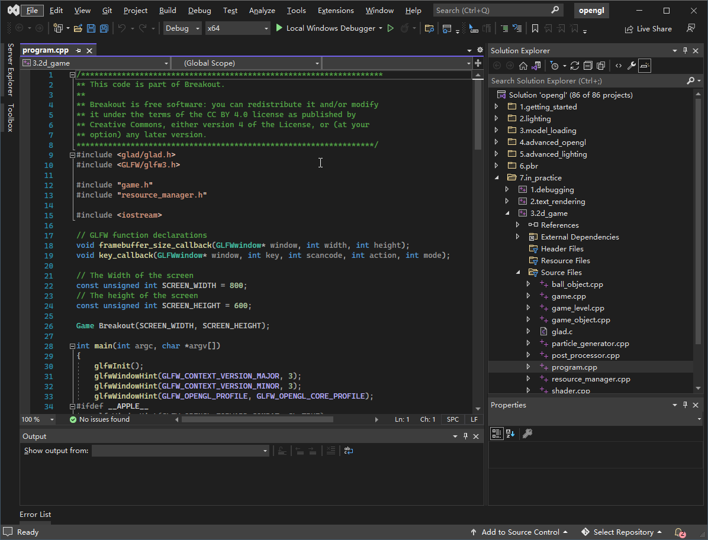
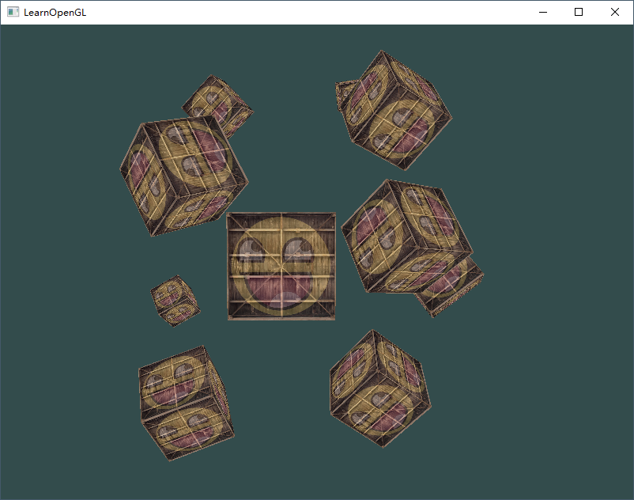
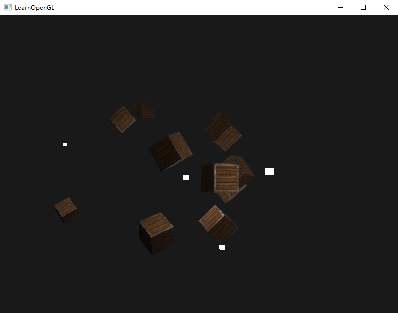
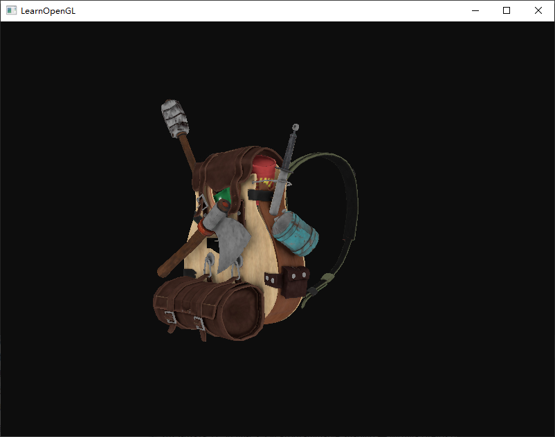
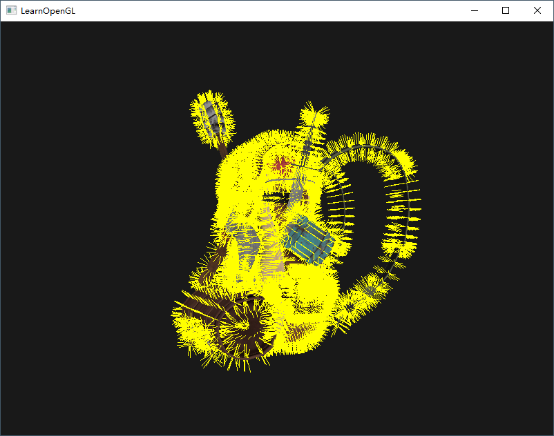
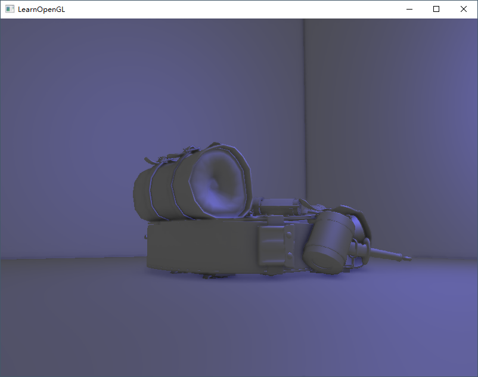
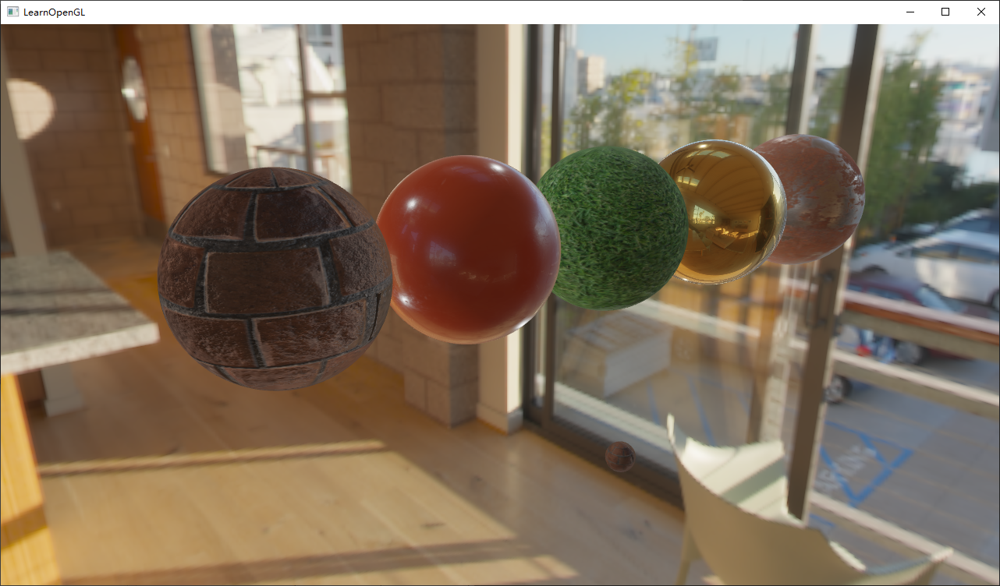
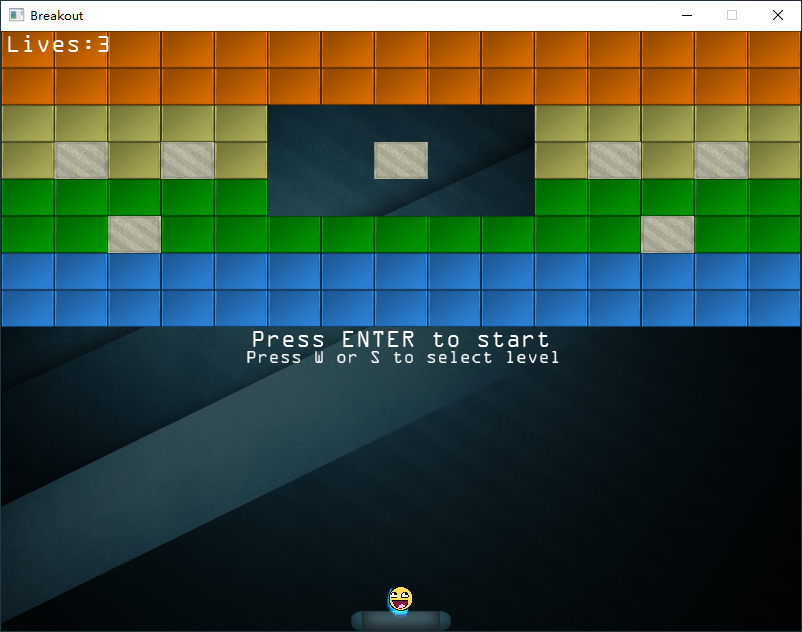

<<<<<<< HEAD
# VS-LearnOpenGL
Code repository of learnopengl, made by Visual Studio 2022.
The repository includes all necessary head, source, lib and dll files.
All projects have been tested on Windows 10 OS.

If you enjoy the repository, please give my repo a star ⭐ ⬆️. 

## How to use it
Please download and install [Visual Studio Community 2022](https://visualstudio.microsoft.com/vs/community/) first.
Clone the repository to your local hard drive, then open opengl.sln.
Open solution property page and change "Startup Project" to "Current selection".

Now, select one of projects and you're able to run it!

## Screenshots

=======
# VS-LearnOpenGL
Code repository of learnopengl, made by Visual Studio 2022.
The repository includes all necessary head, source, lib and dll files.
All projects have been tested on Windows 10 OS.

If you enjoy the repository, please give my repo a star ⭐ ⬆️. 

## How to use it
Please download and install [Visual Studio Community 2022](https://visualstudio.microsoft.com/vs/community/) first.
Clone the repository to your local hard drive, then open opengl.sln.
Open solution property page and change "Startup Project" to "Current selection".

Now, select one of projects and you're able to run it!

## Screenshots

>>>>>>> 35b0abcc726a0b7fd49a7fae1435d533aca0afec
